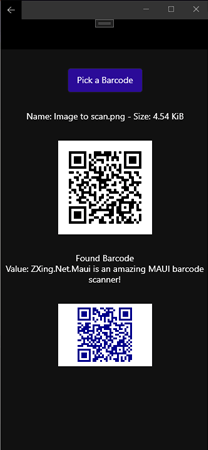
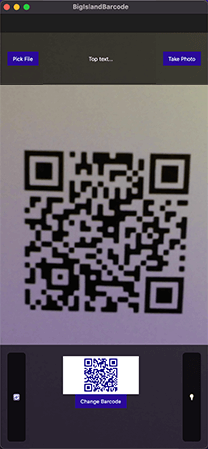

# ZXing.Net.Maui.Jgdev
[](https://www.nuget.org/packages/ZXing.Net.Maui.Jgdev/)

The successor to ZXing.Net.Mobile, providing barcode generation and scanning from a camera or files - and all cross platform! _(except windows - see below)_

A fork of [Redth/ZXing.Net.MAUI](https://github.com/Redth/ZXing.Net.MAUI), with code reworks and improvements _(in my opinion)_

Android<br/>(Camera Scanning) | Windows<br/>(File Scanning) | Mac/iOS<br/>(Camera Scanning)
:-:|:-:|:-:
 |  | 

## Support

Platform | Min. Version | Barcode Generating | Camera Scanning | File Scanning
--- | --- | --- | --- | ---
Android | 12 (API 31) | ✔ | ✔ | ✔
iOS | 10 | ✔ | ✔ | ✔
macOS | 14 | ✔ | ✔ | ✔
Windows | 11 OR 10 (> 1809) | ✔ | ❌<sup>**Ŧ**</sup> | ✔

<sup>**Ŧ**</sup> <small>_There is no MAUI support for the camera yet. We are monitoring CommunityToolkit/Maui#259 - For now, Windows just loads a black screen, you will need to detect/redirect_</small>

## Install ZXing.Net.MAUI

1. Install [ZXing.Net.MAUI](https://www.nuget.org/packages/ZXing.Net.Maui) NuGet package on your .NET MAUI application

1. Make sure to initialize the plugin first in your `MauiProgram.cs`, see below

    ```csharp
    // Add the using to the top
    using ZXing.Net.Maui;
    
    // ... other code 
    
    public static MauiApp Create()
    {
    	var builder = MauiApp.CreateBuilder();
    
    	builder
    		.UseMauiApp<App>()
    		.UseBarcodeReader(); // Make sure to add this line
    
    	return builder.Build();
    }
    ```

Now we just need to add the right permissions to our app metadata. Find below how to do that for each platform.

#### Android

For Android go to your `AndroidManifest.xml` file (under the Platforms\Android folder) and add the following permissions inside of the `manifest` node:

```xml
<uses-permission android:name="android.permission.CAMERA" />
```

#### iOS

For iOS go to your `info.plist` file (under the Platforms\iOS folder) and add the following permissions inside of the `dict` node:

```xml
<key>NSCameraUsageDescription</key>
<string>This app uses barcode scanning to...</string>
```

Make sure that you enter a clear and valid reason for your app to access the camera. This description will be shown to the user.

#### Windows

As stated above, Windows can not perform camera scanning. You can however use the image scanning and barcode generation. No extra permissions are required for these.

For more information on permissions, see the [Microsoft Docs](https://docs.microsoft.com/dotnet/maui/platform-integration/appmodel/permissions).

>⚠ If you're using the controls from XAML, make sure to add the right XML namespace in the root of your file
>e.g: `xmlns:zxing="clr-namespace:ZXing.Net.Maui.Controls;assembly=ZXing.Net.MAUI"`

## Usage

### Barcode Scanning

```xaml
<zxing:CameraBarcodeReaderView 
    x:Name="cameraBarcodeReaderView"
    BarcodesDetected="BarcodesDetected" />
```

**Scanning options/features**
```csharp
// Configure Reader options
cameraBarcodeReaderView.Options = new BarcodeReaderOptions
{
    Formats = BarcodeFormats.OneDimensional,
    AutoRotate = true,
    Multiple = true
};
    
// Handle detected barcode(s)
protected void BarcodesDetected(object sender, BarcodeDetectionEventArgs e)
{
    foreach (var barcode in e.Results)
        Console.WriteLine(
            $"Barcodes: {barcode.Format} -> {barcode.Value}"
        );
}

// Toggle Torch
cameraBarcodeReaderView.IsTorchOn = !cameraBarcodeReaderView.IsTorchOn;

// Flip between Rear/Front cameras
cameraBarcodeReaderView.CameraLocation = 
    cameraBarcodeReaderView.CameraLocation == CameraLocation.Rear 
        ? CameraLocation.Front 
        : CameraLocation.Rear;
```

### Barcode Generator View
```xaml
<zxing:BarcodeGeneratorView
    HeightRequest="100"
    WidthRequest="100"
    ForegroundColor="DarkBlue"
    Value="https://dotnet.microsoft.com"
    Format="QrCode"
    Margin="3" />
```

### Image Stream Scanning

We also support scanning file streams 

```CSHARP
// To pick a photo from storage
var result =
    await FilePicker.PickAsync(new()
        {
            FileTypes = FilePickerFileType.Images,
            PickerTitle = "Choose your barcode"
        }
    );

// To take a photo
var result = 
    await MediaPicker.Default.CapturePhotoAsync(new()
        {
            Title = "Take a photo of the barcode"
        }
    );

// Use the result, if there is one
if (result != null)
{
    using var stream = await result.OpenReadAsync();

    var reader =
        new ZXingBarcodeReader
        {
            Options = new BarcodeReaderOptions
            {
                Formats = BarcodeFormats.All,
                AutoRotate = true
            }
        };

    var results = reader.Decode(stream);
    
    foreach (var barcode in results)
        Console.WriteLine(
            $"Barcodes: {barcode.Format} -> {barcode.Value}"
        );
}
```
